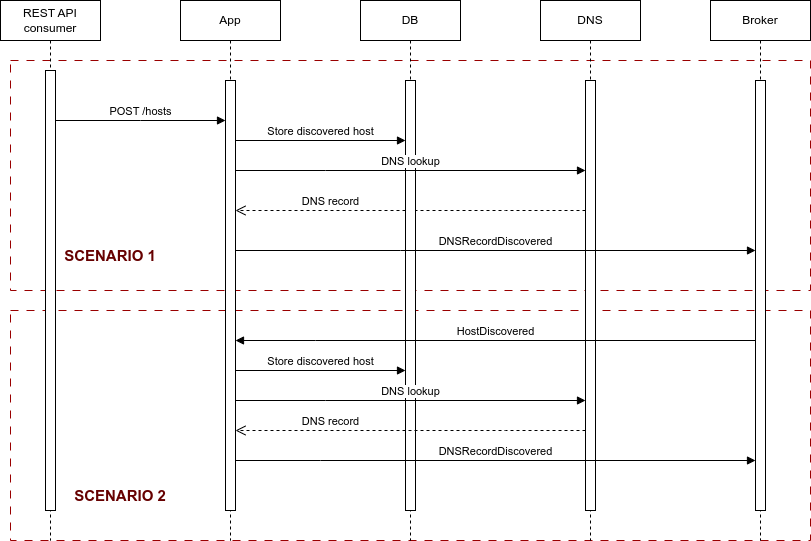

# Active Host Discovery
- [Active Host Discovery](#active-host-discovery)
  - [Overview](#overview)
  - [System architecture](#system-architecture)
  - [Application architecture](#application-architecture)
    - [Presentation layer](#presentation-layer)
    - [Service layer](#service-layer)
    - [Data layer](#data-layer)
  - [Extensibility](#extensibility)
    - [Example](#example)
  - [Improvements](#improvements)

## Overview
The following document describes the architecture and the implementation of an
active host discovery application.
Briefly, the application receives information about
newly discovered hosts, stores them in DB, looks them up in a DNS service and
if they are found active publishes them to a broker.

## System architecture
The application is supposed to interact with 3 external components:
* A DNS service where it gets information about whether a given host is active
* A broker to whom is attached listening to incoming events regarding newly
  discovered hosts. As soon as an active DNS record is discovered the relevant
  data is published to the broker.
* A DB where are saved the newly discovered hosts.

The following diagram depicts the system architecture involving the app as well
as the external components:

The application enables access via two channels:
* A REST API
* Listening for broker messages via predefined subscriptions

The following diagram depicts one scenario per case:

## Application architecture
The application is implemented in a three-layer architecture:

### Presentation layer
The REST API is served via [FastAPI](https://fastapi.tiangolo.com/) and the app
can subscribe and listen to topics of a [Redis](https://redis.io/) broker.
As soon as a message arrives via either channel a service event will be raised
and handled in the service layer.

### Service layer
The main component here is a message bus which handles the events coming from the
presentation layer. Additionally, It utilizes two external (custom built) libraries
for accessing the DNS service and the broker for data publishing.

### Data layer
The database ([TinyDB](https://tinydb.readthedocs.io/en/latest/)) is accessed via
dedicated repositories.

## Extensibility
The application layout is quite modular and low level access is abstracted away thus
enabling easy addition of new features. Here are some general guidelines:
* New REST API router
  * add a new controller in `host_discovery.routers.http.hosts`
* New broker subscription
  * add a new controller in `host_discovery.routers.broker.hosts`
* New business logic
  * Add a new service event and relevant handler(s) in `host_discovery.service.handlers`
    and make sure to call the `message_bus` from the corresponding controller.
* Publish new event
  * Add a new function in `host_discovery.pubsub.publisher` and call it from the
    appropriate service handler.
* New DB access, i.e. host retrieval, update, delete
  * Add new methods in the `HostRepo` of `host_discovery.repos.hosts`

### Example
If we want to crawl the HTML content of an active host and we want the crawling to
take place among the current sequence of actions we need to modify the
`host_discovery.service.handlers` by adding another service event handler and include
it with the rest handlers of the respective event.

## Improvements
* The libraries in `lib` package should ideally live in separate repositories and be
  installed via `requirements.txt`
* The DNS service lookup is not supposed to return an immediate response since its
  result is published in the broker. Thus, it can be handled as a background process, e.g.
  run with [Celery](https://docs.celeryq.dev/en/stable/index.html).
